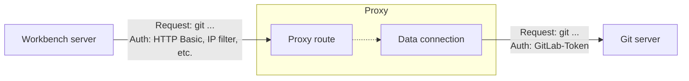

# Set up a proxy route to a Git server

Git proxy routes allow to conceal all potentially sesitive Git access information from a workbench server. 

## Configure a Git proxy API

Steps to set up a proxy connection to a Git repo:

1. Add an access key to the Git repo or a repo group to make sure the proxy can only access that particular repo or group
	- Role "Developer"
	- Scopes to read/write repository
2. Add/copy a proxy route to this connection
	- Add an HTTP connection to the proxy workbench metamodel with the repo HTTPS URL and the key from above
3. Configure authorization policies for the route 
	- Add a user role
	- Add a user and git that user the new role
	- Create a policy for the `ProxyFacade`
4. Clone the repo on the client using the URL of the proxy and the `Authorization` HTTP header as shown below

## Clone the repo

1. Log in to the target server and go to `Administration > Metamodel > Apps`. 
2. Press `Git console` without selecting any app
3. Paste the following command and press enter

`git clone https://<username>:@domain.com/api/proxy/git/myrepo.git c:\path_to_workbench\vendor\myvendor\myapp -c http.extraHeader="Authorization: Basic <username:password (as Base64)>"`